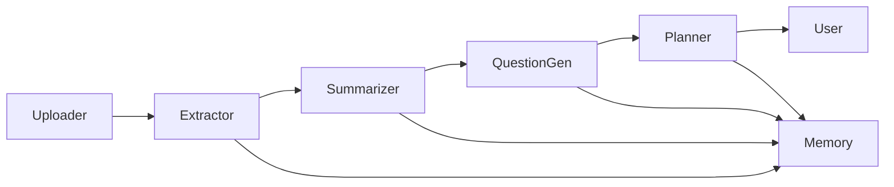

# StudyMate — Multi-Agent Study Assistant

StudyMate is a multi-agent system built for the **Kaggle Agents Intensive Capstone Project**.  
It automatically extracts notes, summarizes content, generates practice questions, and creates personalized study schedules.

This project demonstrates:
- Multi-agent pipelines  
- Custom tools  
- Memory and session tracking  
- Practical AI automation using LLM-powered agents  

---

## 🚀 Features

### ✔ 1. Note Extraction Agent  
Processes PDFs, images, or text using OCR.  
Detects headings and segments content into topics.

### ✔ 2. Summarizer Agent  
Produces clean, 3–5 bullet-point summaries.  
Removes noise while keeping key concepts.

### ✔ 3. Question Generator Agent  
Creates:
- MCQs  
- Short-answer questions  
- Long-answer prompts  
Includes difficulty levels & answers.

### ✔ 4. Schedule Planner Agent  
Builds a study timetable based on:
- Exam date  
- Available hours  
- Number of topics  
- Revision priority  
Uses a simple spaced-repetition strategy.

### ✔ 5. Memory System  
Stores:
- User topics  
- Summaries  
- Progress  
- Generated questions  
All sessions are saved in the Memory Bank.

---

## 🧱 Project Structure

```
studymate/
├── agents/
│   ├── uploader_agent.py
│   ├── extractor_agent.py
│   ├── summarizer_agent.py
│   ├── question_gen_agent.py
│   └── planner_agent.py
├── tools/
│   └── ocr_tool.py
├── memory/
│   └── memory_bank.py
├── notebooks/
│   └── demo.ipynb  (optional demo notebook)
├── README.md
└── requirements.txt
```

---

## 🧠 Architecture Diagram



---

## 🛠 How to Run

### **1. Install requirements**
```
pip install -r requirements.txt
```

### **2. Add your PDFs/images**
Place them anywhere and pass the path to `uploader_agent.py`.

### **3. Run the pipeline (simplified example)**

```python
from agents.uploader_agent import UploaderAgent
from agents.extractor_agent import ExtractorAgent
from agents.summarizer_agent import SummarizerAgent
from agents.question_gen_agent import QuestionGenAgent
from agents.planner_agent import PlannerAgent
from memory.memory_bank import MemoryBank

memory = MemoryBank()
extractor = ExtractorAgent(memory)
summarizer = SummarizerAgent(llm_client=None)  # add LLM here
generator = QuestionGenAgent(llm_client=None)
planner = PlannerAgent()

# Example:
topics = extractor.run("user1", "my_notes.png")
summaries = {t['title']: summarizer.summarize(t['title'], t['text']) for t in topics}
questions = generator.generate(summaries)
schedule = planner.build_schedule(...)
```

---

## 📦 Technologies Used

- **ADK-Python** (Agent Development Kit)
- **Python 3.10+**
- **pytesseract** for OCR
- **Gemini / LLM** (optional)
- **InMemorySessionService / custom Memory Bank**
- **Mermaid diagrams**

---

## 🎯 Kaggle Capstone Requirements Covered

### ✔ Multi-Agent System  
Sequential pipeline of 5 agents.

### ✔ Tools  
Custom OCR tool, PDF/text processing.

### ✔ Memory  
Dedicated Memory Bank with user/session storage.

### ✔ Observability  
Logging + basic metrics.

### ✔ Evaluation  
Test pipeline included in structure.

---

## 🚀 Future Improvements

- Adaptive difficulty based on user performance  
- Web UI for uploading & viewing summaries  
- Cloud deployment using Cloud Run  
- Firestore / SQL for long-term memory  
- Real-time collaborative studying  

---

## 📜 License

This project is for **educational use** as part of the *Kaggle Agents Intensive Capstone Project*.

---

## ⭐ Support

If you like this project, please ⭐ star the repo on GitHub!

